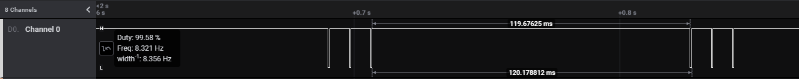
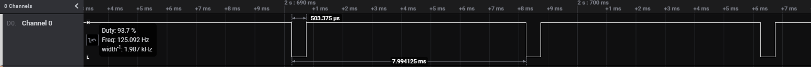
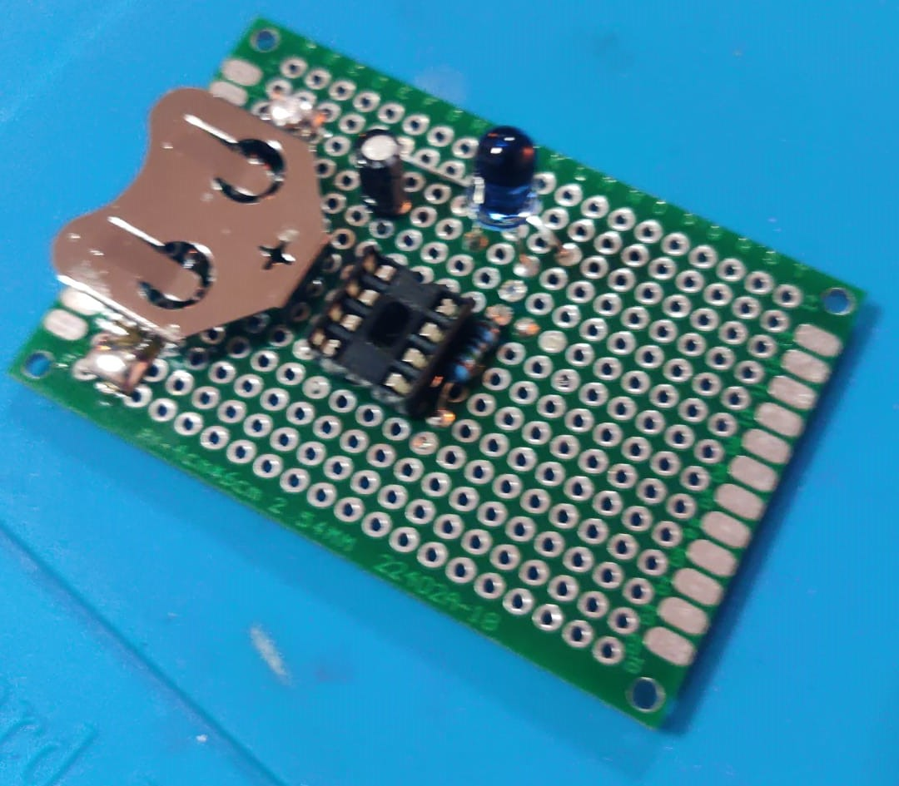

# Attiny85 Roomba Virtual Wall

For roomba 500-, 600-, 700-, 800-, 900-serie & Scooba 400-serie


### The Idea About This Project
The project was developed to create a virtual wall for Roomba. The current virtual walls are quite expensive while they have a fairly simple technique.

In my case I had to create as small a virtual wall as possible for under the radiator.

The choice for an Attiny85 is because this is a light and cheap microcontroller. In sleep mode, the Attiny consumes little power, so 2 AA batteries or a button cell are sufficient.


## To Pulse or Not to Pulse?
To receive the signal, an infrared receiver was used on a logic analyzer. The virtual wall constantly sent the same signal. By repeating this signal, the roomba will think it is a virtual wall.

** Overview Multiple pulses **

** Overview Single pulses **



## Schematic
The schematic for the project is very easy.

- Connect the VCC of a battery or other power source to the VCC of the Attiny
- Connect the GND of a battery or other power source to GND of the Attiny
- Connect PB0 to the IR LED by a Resistor. (Check your IR type (Current) for the right resistor)


## Build & Flashing
Compiling could be done with provided [Docker Container](https://hub.docker.com/repository/docker/jjveldscholten/avr_toolchain)

Flashing is possible by using [ISP Programmer](https://www.amazon.com/HiLetgo-ATMEGA8-Programmer-USBasp-Cable/dp/B00AX4WQ00/ref=sr_1_1_sspa?dchild=1&keywords=avr+isp&qid=1627924687&sr=8-1-spons&psc=1&spLa=ZW5jcnlwdGVkUXVhbGlmaWVyPUFGQUtUNUhKNjlPMjImZW5jcnlwdGVkSWQ9QTA2MTA3NzYzS05YT0UwTFBBWFpQJmVuY3J5cHRlZEFkSWQ9QTEwMTAxNzAyRFRPWEg0MldNQktEJndpZGdldE5hbWU9c3BfYXRmJmFjdGlvbj1jbGlja1JlZGlyZWN0JmRvTm90TG9nQ2xpY2s9dHJ1ZQ==)


### Requirements
- AVRDude for Flashing [More Info](https://learn.adafruit.com/usbtinyisp/download)
- USB ISP or something else for Flashing; example: [ISP Programmer](https://www.amazon.com/HiLetgo-ATMEGA8-Programmer-USBasp-Cable/dp/B00AX4WQ00/ref=sr_1_1_sspa?dchild=1&keywords=avr+isp&qid=1627924687&sr=8-1-spons&psc=1&spLa=ZW5jcnlwdGVkUXVhbGlmaWVyPUFGQUtUNUhKNjlPMjImZW5jcnlwdGVkSWQ9QTA2MTA3NzYzS05YT0UwTFBBWFpQJmVuY3J5cHRlZEFkSWQ9QTEwMTAxNzAyRFRPWEg0MldNQktEJndpZGdldE5hbWU9c3BfYXRmJmFjdGlvbj1jbGlja1JlZGlyZWN0JmRvTm90TG9nQ2xpY2s9dHJ1ZQ==)

#### Instructions to build with ToolChain Docker

```bash
docker cp . avr-toolchain:/build
docker exec -i avr-toolchain bash -c "avr-gcc -Wall -g -Os -mmcu=attiny85 -o main.bin main.c"
docker exec -i avr-toolchain bash -c "avr-objcopy -j .text -j .data -O ihex main.bin main.hex"
mkdir bin    
docker cp avr-toolchain:/build/main.bin ./bin/
docker cp avr-toolchain:/build/main.hex ./bin/
echo Build Done
```


#### Flash
Pick binary from the Relases tab and flash it by ISP Programmer. AVRDude is a simple tool to flash bin files to AVR.
For flashing use the following commands

```bash
avrdude -c usbasp -p t85 -B 0.5 -U flash:w:".\bin\main.hex":a 
```


## Results
The following picture is my own simple prototype PCB. 


## Contributing
Pull requests are welcome. For major changes, please open an issue first to discuss what you would like to change.

Please make sure to update tests as appropriate.

## License
[MIT](https://choosealicense.com/licenses/mit/)